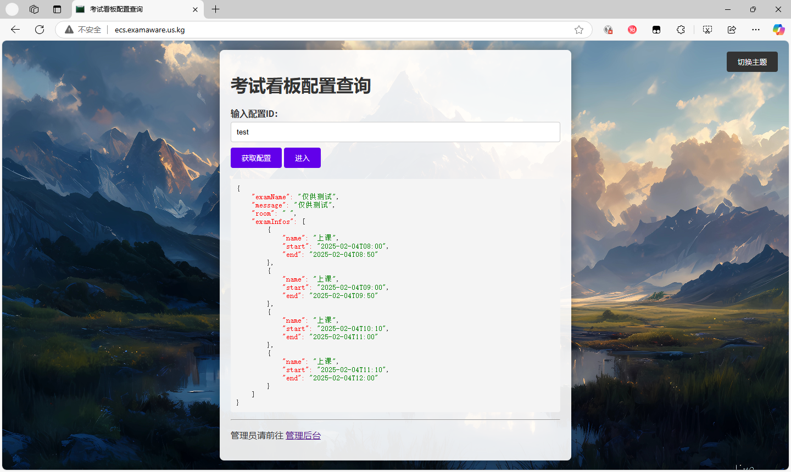
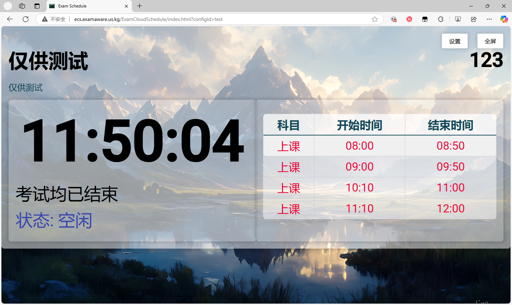
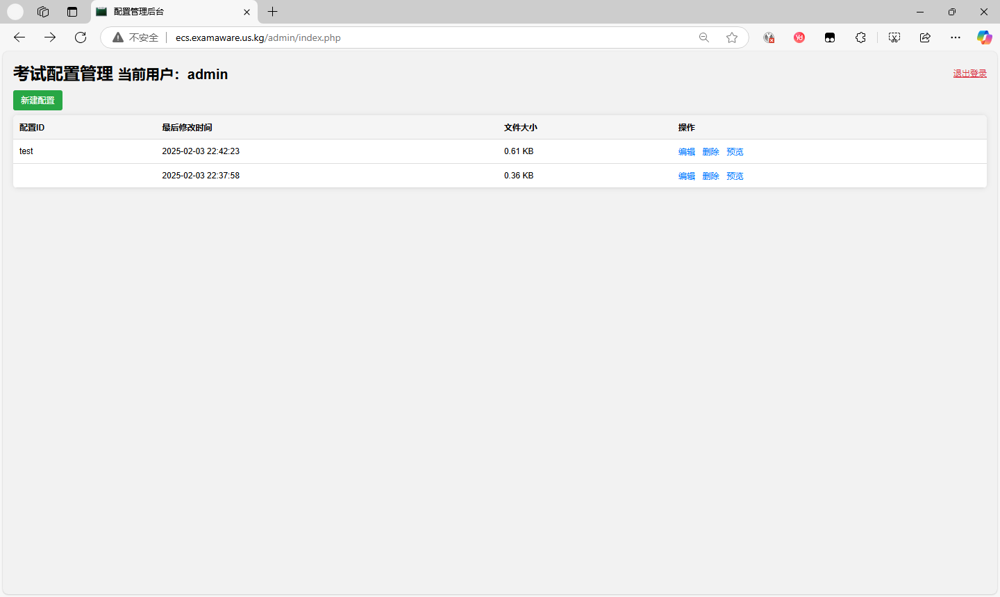
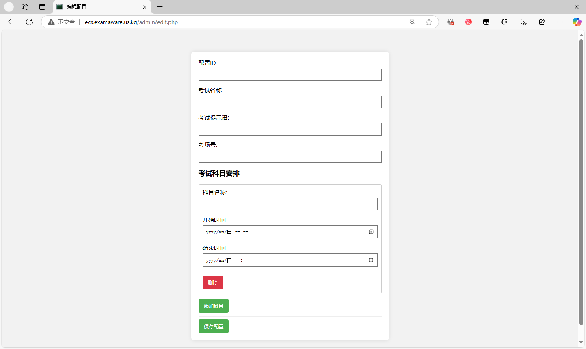

[ExamCloudSechdule 考试云看板](https://github.com/ExamAware/ExamCloudSchedule) 是一个用于管理和查看考试安排的系统，包括以下几个主要功能：

1. **考试看板配置查询**：用户可以通过输入配置 ID 来获取考试安排的详细信息。

2. **考试安排显示**：显示考试的详细安排，包括科目、开始时间和结束时间。

3. **管理员后台**：管理员可以登录后台管理考试配置文件，包括创建、编辑和删除配置文件。

4. **明暗色主题**: 随心所欲切换主题。

## 文件结构

- `/index.php`：考试看板配置查询页面。
- `/ExamCloudSchedule`：考试安排显示页面。
- `/admin/login.php`：管理员登录页面。
- `/admin/index.php`：管理员后台主页，显示所有配置文件。
- `/admin/edit.php`：编辑或创建新的考试配置文件。
- `/admin/detete.php`: 删除指定配置文件。
- `/includes`: 管理员认证目录。
- `/configs`: 安排存放目录。

## 使用方法

### 考试看板配置查询

1. 打开根目录页面。
2. 输入配置 ID，例如 `room301`。
3. 点击“获取配置”按钮，查看考试安排的详细信息。
4. 点击“进入”按钮，跳转到考试安排显示页面。

### 考试安排显示

1. 上一部操作后会打开 `ExamCloudSchedule/index.html` 页面。
2. 页面会自动根据 URL 参数 `configId` 显示相应的考试安排。

### 管理员后台

1. 点击 `管理后台` 或者，手动打开 `admin` 目录，输入管理员用户名和密码进行登录。  
> [!tip]
>
> 管理员用户名和密码初始均为 `admin`。

2. 登录后，跳转到 `admin/index.php` 页面，显示所有配置文件。

3. 点击“新建配置”按钮，跳转到 `admin/edit.php` 页面，创建新的配置文件。

4. 在配置文件列表中，可以点击“编辑”按钮编辑配置文件，点击“删除”按钮删除配置文件，点击“预览”按钮查看配置文件的详细信息。

## 开发环境

- PHP 7.4+
- HTML5
- JavaScript
- CSS3

## 安装和运行

1. 克隆项目到本地
2. 将项目文件放置到 Web 服务器的根目录下
3. 确保 Web 服务器支持 PHP，并启动服务器
4. 访问 `index.php` 页面，开始使用系统

## CodeSpace 开发提示

```bash
# 初始化 Codespace 时运行：

sudo sed -i 's/Listen 80$//' /etc/apache2/ports.conf
sudo sed -i 's/<VirtualHost \*:80>/ServerName 127.0.0.1\n<VirtualHost \*:8080>/' /etc/apache2/sites-enabled/000-default.conf
apache2ctl start

# 以后直接运行：

apache2ctl start
```