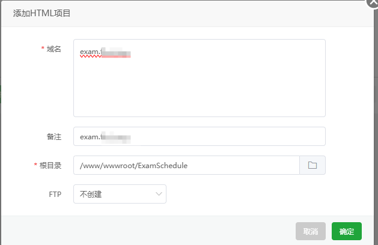
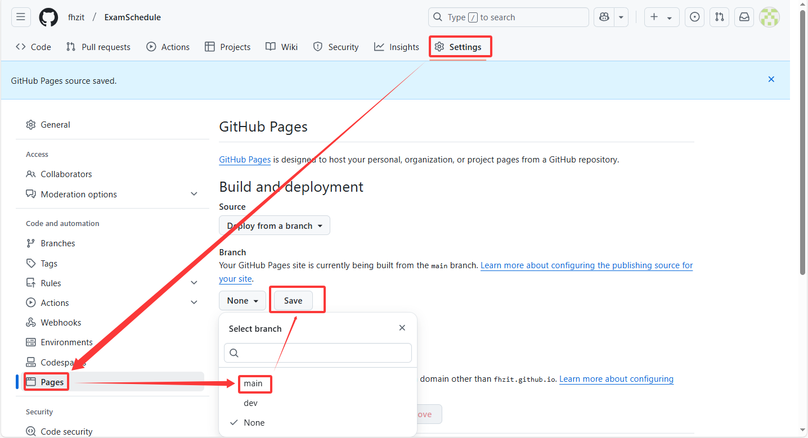
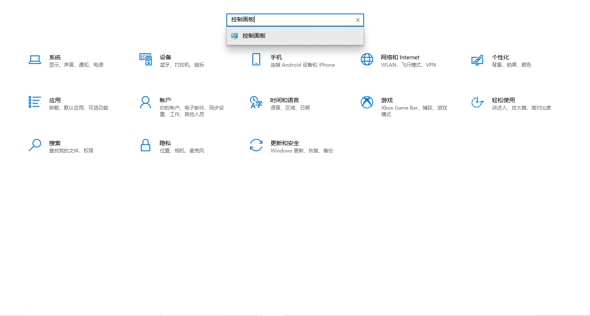
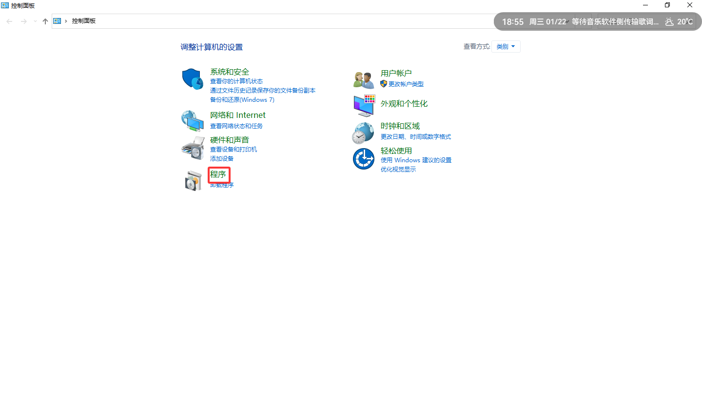
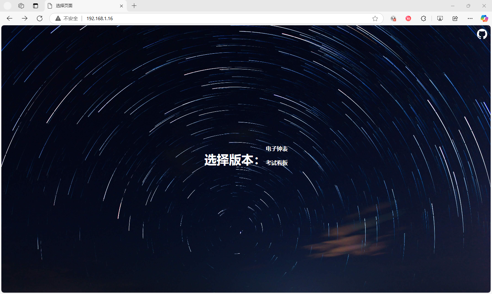

## 使用Python部署
 - 确保已安装 [Python](https://www.python.org/downloads/) 环境   
 - 下载最新版的项目代码
 - 执行以下命令启动本地服务器：
    ```bash
    python3 -m http.server 8000
    ```   
 - 打开浏览器，访问 `http://localhost:8000` 或`http://IP:8000/`即可查看考试安排。 
  
> [!tip]
> 可以自行修改8000端口为您设置的端口。

## 使用宝塔面板部署
 - 确保已安装[宝塔面板](https://www.bt.cn/new/download.html)   
 - 将域名解析A记录解析到您的服务器IP地址。
 - 在宝塔面板中，点击 `网站` -> `HTML项目`-> `添加站点`。
 
 - 在 `域名` 中输入您的域名。  
 
 - 在 `网站根目录` 中上传最新版的项目代码。   
 - 点击 `确定` 即可完成部署。
> [!tip]
>
>如果您没有域名，可以前往[购买域名](https://www.dynadot.com/?s59Ms8lK8u7gQ)。
>或者您也可以直接使用IP+端口直连访问。
>

## 使用GitHub Page部署

- 将项目代码fork到您的GitHub仓库。
- 在GitHub仓库中，进入 `Settings` -> `Pages`。
- 在 `Source` 部分选择 `main` 分支并保存。

- GitHub Pages 将会自动部署项目，稍后即可通过提供的URL访问。   
> [!tip]
>
> 您可以在`Custom domain`部分填入您的自定义域名，并将您的自定义域名`CNAME`解析到`{owner}.github.io`。
>   

## 使用IIS部署
- 开启IIS功能     
1.打开`设置`    
   
2.输入`控制面板` 
  
3.点开`程序`  
   
4.点击`启用或关闭Windows功能`    
5.勾选`Internet Information Services`并点击`确定`    
6.点击`确定`，等待安装完成。   
   
- 部署`ExamSchedule`服务
1.在任务栏的`搜索框`中输入`IIS`并点击`IIS管理器`进入管理页面。  

2.在左侧导航栏中，选择`网站`右键点击`添加网站`。

3.在此输入网站名称：`ExamSchedule`        
- 物理路径:`C:\inetpub\wwwroot`    
- IP地址：可以是全部未分配，也可以是网卡地址，建议使用网卡地址，这样校园局域网下，就可以通过网卡地址访问    
- 端口：最好是默认的80端口，一般网站访问网址也是默认访问80的，不需要同时输入网址和端口，可通过网址直接访问    
- 主机名：这里设置网址，可以通过这个网址直接访问，当端口不是80时，需要网址加端口才能访问(当仅在局域网访问的情况下,主机名可以随意填写) 

填写完成后，点击`确定`。


4.点击右侧的`浏览`会跳转到网站的根目录    
   
5.上传`ExamSchedule`项目代码到网站根目录。   

6.最后，在浏览器中输入您的网卡地址(教程中的地址为`192.168.1.16`)，看到如下图片即部署成功   

> [!tip]
> 如果您希望在公网访问，需要在域名提供商处添加A记录，将域名解析到您的服务器IP地址，并填写正确的主机名。   
>

# 终极部署方案
都不会部署？或者……尝试终极解决方案：
邮箱联系 `admin@fhzit.top` ，如果我有空我可以为你的安装提供帮助😊
