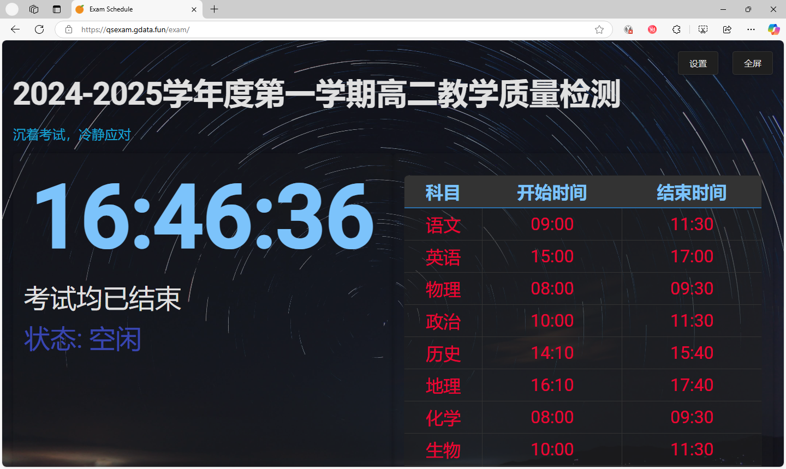
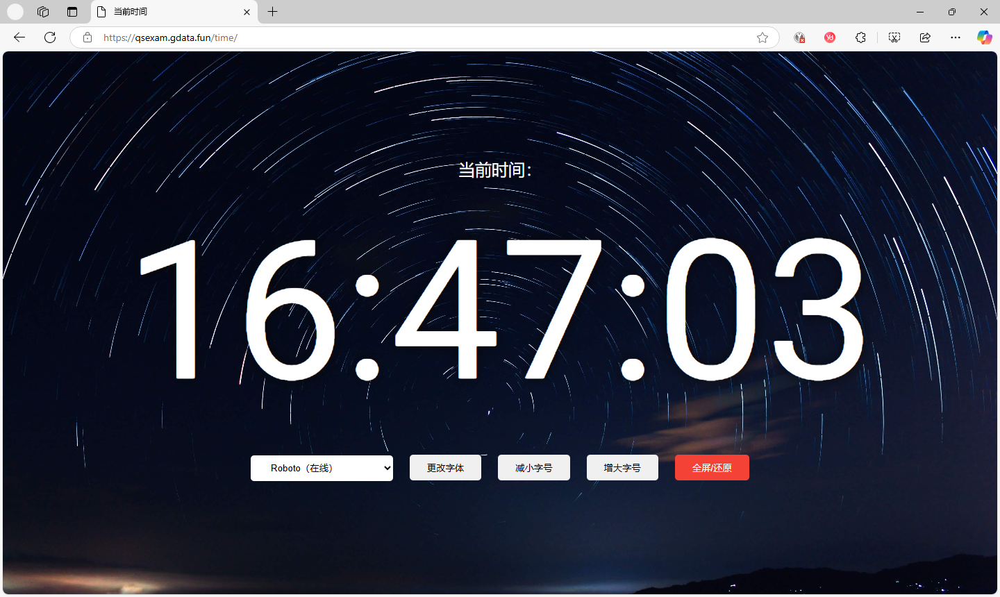

由于 ExamAware 桌面端受限制于框架问题，无法在除[指定系统平台](../introduction/choose.md#检查系统版本)外的老旧平台系统上运行。因此，为了更好地满足用户需求，我们推出了网页端考试看板 [ExamSchedule](https://github.com/ExamAware/ExamSchedule) 。

## 功能

- 实时显示当前时间、当前考试科目、考试起止时间、剩余时间及考试状态。
- 支持全屏显示。
- 支持设置时间偏移和考场信息，并保存到浏览器Cookie中。
- 支持临时编辑消息，并保存到浏览器Cookie中（3天后到期）。

### 设置说明

点击设置按钮可以打开设置窗口，进行以下配置：

- **时间偏移**：用于调整显示的时间，单位为秒。
- **考场信息**：用于显示当前考场的名称。
- **页面缩放倍数**：用于调整页面显示的缩放倍数。

配置完成后点击保存按钮，设置将会保存到浏览器的Cookie中，并立即生效。

### 编辑消息

点击编辑消息按钮可以打开消息编辑窗口，进行以下操作：

- **消息内容**：用于临时编辑显示的消息。

编辑完成后点击保存按钮，消息将会保存到浏览器的Cookie中，并立即生效（3天内有效）。

## 软件截图

### 主界面
   

#### 考试展板界面
   

#### 电子钟表界面   

## 开始部署
请参阅[部署教程](../web/deploy.md)。

